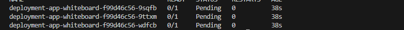
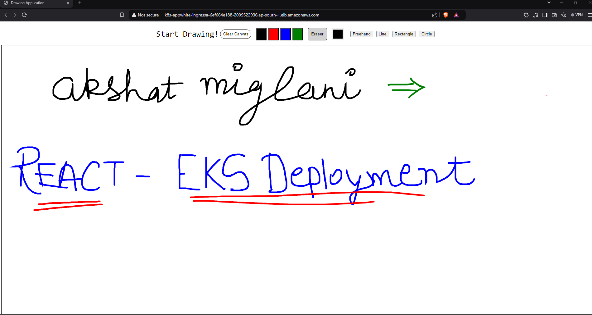

# react-on-kubernetes

Full playlist for this project:

https://www.youtube.com/playlist?list=PLImBl83-yYwoIKVY4fU4X8wl3c5XPLjyD

This project focuses on deploying a React-based whiteboard application to Amazon Elastic Kubernetes Service (EKS). The goal is to create a scalable and reliable deployment using Kubernetes orchestration managed on AWS infrastructure. The aim is to successfully configure load balancing, ingress and security mechanisms.

## Project Objectives

1. Develop a React Application: Set up a simple whiteboard/drawing app as the application to be deployed.

2. Containerize the application: Package the React app into a Docker container for deployment.

3. Set up EKS Cluster: Create and configure EKS cluster using the AWS CLI and later interacting it with kubectl.

4. New fargate Profile : Configure Fargate to run worker nodes in a serverless environment.

5. Deploying Kubernetes Objects : Set up Deployment, Service, and Ingress configurations for your React app.

6. Ingress Controller Configuration: Configuring the ingress controller to manage traffic and act as a load balancer.

7. Configuring OIDC and Authentication: Integrate OpenID Connect for AWS IAM (Identity Access Management).

8. Deploy ALB Controller: Use the Application Load Balancer Controller to route external traffic to the application.


## Introduction of Concepts:

EKS is a managed Kubernetes service by AWS. It simplifies running Kubernetes clusters on AWS infrastructure. Kubernetes automates container orchestration tasks such as deployment, scaling, and managing workloads.

Fargate: A serverless compute engine that allows you to run containers without managing EC2 instances.


kubectl: A command-line tool used to interact with Kubernetes clusters.


Deployment: Manages the creation and scaling of your application's pods.


Service: Exposes the application running on pods to external traffic or other services.


Ingress: Manages HTTP and HTTPS routing to services.

Ingress Controller routes external traffic to Kubernetes services. The AWS Load Balancer Controller integrates with ALB (Application Load Balancer) to handle HTTP/HTTPS requests.

OIDC is an authentication protocol for securely verifying user identities. AWS uses OIDC to provide secure access to EKS and other AWS services.

## Implementation

1. Configure AWS credentials in your environemnt.
```bash
aws configure
```
Required details include 
- AWS Access Key ID
- AWS Secret Access Key
- Default Region
- Output Format.


2. Create an EKS Cluster with Fargate

```bash
eksctl create cluster --name drawing-app-cluster --region ap-south-1 --fargate
```

- cluster_name is 'drawing-app'
- region is 'ap-south-1'
- farage allows to run compute nodes in serverless environements


3. Configuring Kubecl

```bash
aws eks update-kubeconfig --name drawing-app-cluster --region ap-south-1     
```

- To interact with created EKS cluster, update the local kubeconfig file.


4. Create a new fargate profile to schedule pods in specific namespace.

```bash
eksctl create fargateprofile --cluster drawing-app-cluster --region ap-south-1 --name demo-fargate --namespace app-whiteboard
```

- farage profile is demo-fargate
- namespace is app-whiteboard.


5. Deploy your Application

```bash
kubectl apply -f deployment.yaml
```

This file defines the 
- Deployment: 3 Replicas of React applicatiopn
- Service: A clusterIP service that exposes port 80
- Ingress : Configuration for AWS ALB Ingress Controller

6. Verify pods and services.

- Check the pods

```bash
kubectl get pods -n app-whiteboard
```



- Check the service

```bash
kubectl get svc -n app-whiteboard 
```


The service has ClusterIP and no external IP initially.

- Check the ingress

```bash
kubectl get ingress -n app-whiteboard 
```


At this moment, ALB is created but address is not listed.

7. Enable IAM OIDC Provider for EKS

Associate the IAM OIDC provider with the EKS cluster to allow AWS services to authenticate Kubernetes pods:

```bash
eksctl utils associate-iam-oidc-provider --cluster drawing-app-cluster --approve
```

8. Configuring AWS Load Balancer Controller

- Use the IAM policy json in current repository to create a new IAM Policy 

```bash
aws iam create-policy --policy-name AWSLoadBalancerControllerIAMPolicy --policy-document file://iam_policy.json
```

- Create a IAM Service Account for the ALB Controller in the kube-system namespace

```bash
eksctl create iamserviceaccount --cluster=drawing-app-cluster --namespace=kube-system --name=aws-load-balancer-controller --role-name AmazonEKSLoadBalancerControllerRole --attach-policy-arn=arn:aws:iam::<your:account:id>:policy/AWSLoadBalancerControllerIAMPolicy --approve
```

- Add the Helm repo for AWS Load Balancer Controller

```bash
helm repo add eks https://aws.github.io/eks-charts
helm repo update eks
```

- Install the AWS Load Balancer Controller

```bash
helm install aws-load-balancer-controller eks/aws-load-balancer-controller  -n kube-system --set clusterName=drawing-app-cluster --set serviceAccount.create=false --set serviceAccount.name=aws-load-balancer-controller --set region=ap-south-1 --set vpcId=<your:vpc:id>
```


9. Verify Controller Installation

- Check deployment

```bash
kubectl get deployment -n kube-system 
```

- Check Pods

```bash
kubectl get pods -n kube-system
```

- Check ingress to confirm the ALB is successfully created.

```bash
kubectl get ingress -n app-whiteboard
```


10. Access the Application by accesssing the ALB DNS name provided in the Ingress.



## Links for Tools

Helm: https://github.com/helm/helm/releases

Kubectl: https://kubernetes.io/docs/reference/kubectl/

AWS CLI: https://aws.amazon.com/cli/

EKSCTL: https://eksctl.io/installation/

## Additional Commands Used:

To use the latest docker image:

```bash
kubectl rollout status deployment/deployment-app-whiteboard -n app-whiteboard
```

To delete the cluster


```bash
kubectl delete -f deployment.yaml

kubectl delete namespace app-whiteboard

eksctl delete fargateprofile --cluster drawing-app-cluster --region ap-south-1 --name demo-fargate

eksctl delete cluster --name drawing-app-cluster --region ap-south-1
```

To create the docker image

```bash
docker build -t DOCKER_USERNAME/react-drawing .

docker push DOCKER_USERNAME/react-drawing
```
